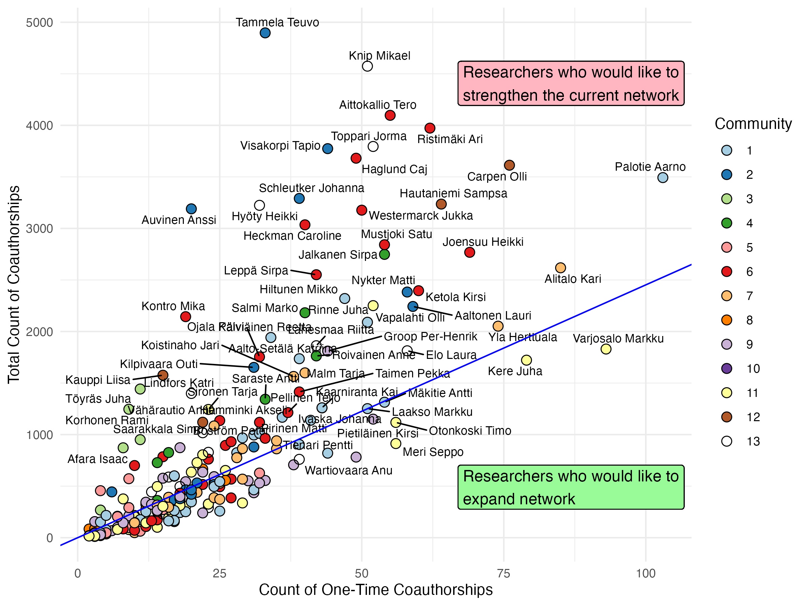

Readme
================
2026-04-01

# Juselius_backdoor



**Juselius_backdoor** is an R pipeline for constructing and analyzing
coauthorship networks of **Sigrid Juselius Foundation** grantees using
**OpenAlex author IDs**. It extracts authors from a text file, resolves
their OpenAlex IDs, retrieves their publications, and builds a weighted
coauthorship network.

------------------------------------------------------------------------

## Features

- Extracts grantee names from text files.  
- Resolves authors to **OpenAlex IDs**.  
- Collects publication data for each author.  
- Builds a weighted coauthorship network.  
- Computes network metrics:
  - Degree (number of collaborators)  
  - Weighted degree  
  - Betweenness (key connectors)  
  - Eigenvector centrality (influence)  
- Detects communities using the **Louvain algorithm**.  
- Generates visualizations:
  - Network graph with community coloring  
  - **Scatter plot of one-time vs. total coauthorship**  
  - Histograms of centrality measures  
- Exports networks for **Gephi** analysis (`.gml` format).

------------------------------------------------------------------------

## Installation

``` r
# Install required packages
install.packages(c(
  "httr", "jsonlite", "dplyr", "igraph", "ggraph", 
  "tidygraph", "ggplot2", "ggrepel", "viridis"
))
```

------------------------------------------------------------------------

## Usage

1.  Place your grantee text file in the project folder (e.g.,
    `jus2026adult.txt`).

2.  Run the pipeline R scripts in order:

    - Extract author names
    - Search OpenAlex IDs
    - Retrieve papers
    - Build the coauthorship network
    - Compute network metrics
    - Visualize results

## Output

- Weighted coauthorship network (`.gml`) for Gephi
- Network metrics per author (`netSummary`)

``` r
library(knitr)
netSummary <- read.csv("netSummary.csv")
top10 <- netSummary[order(-netSummary$wdegree), ][1:10, ]
top10_display <- top10[, c("author", "degree", "wdegree", "betweenness", "community", "primary_neighbor_MaxW")]
kable(top10_display, format = "markdown")
```

|  | author | degree | wdegree | betweenness | community | primary_neighbor_MaxW |
|:---|:---|---:|---:|---:|---:|:---|
| 193 | Tammela Teuvo | 33 | 4897 | 0.0006030 | 2 | Auvinen Anssi |
| 88 | Knip Mikael | 51 | 4574 | 0.0297573 | 13 | Toppari Jorma |
| 6 | Aittokallio Tero | 55 | 4097 | 0.0152286 | 6 | Kontro Mika |
| 165 | Ristimäki Ari | 62 | 3973 | 0.0156645 | 6 | Haglund Caj |
| 199 | Toppari Jorma | 52 | 3795 | 0.0267586 | 13 | Knip Mikael |
| 213 | Visakorpi Tapio | 44 | 3774 | 0.0185478 | 2 | Nykter Matti |
| 33 | Haglund Caj | 49 | 3681 | 0.0164748 | 6 | Ristimäki Ari |
| 19 | Carpen Olli | 76 | 3613 | 0.0279969 | 12 | Hautaniemi Sampsa |
| 147 | Palotie Aarno | 103 | 3493 | 0.0462684 | 1 | Pirinen Matti |
| 182 | Schleutker Johanna | 39 | 3291 | 0.0000411 | 2 | Tammela Teuvo |

- Visualizations of network structure and centrality

## [View Interactive Co-authorship Network](https://jafarilab.github.io/Juselius_backdoor/network.html)

## License

MIT License – free to use and modify.


    This is a fully self-contained **R Markdown README**.  

    If you want, I can also add a **“Quick Start” code chunk** at the top so users can generate the scatter plot in **one go**, which is very handy for GitHub. Do you want me to do that?
